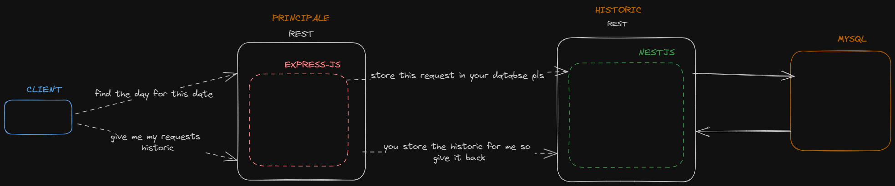

## Examen Services web

# Solution

Nous avons crée deux service web de type REST qui communique.

## Principale

Le service web principale a été dévéloppé en utilisant le framework express.

### Endpoints

- [POST] /dayfinder: qui recoit une date au format jj-mm-aaa. si la date n'est pas au bon format on renvoie une erreur 400 Bad Request.
  On converti la date recu, on trouve le jour et ensuite on renvoie la reponse au client.
  une fois que le client recoit la reponse, on fait un appel au second service pour lui dire de sauvegarder l'historique pour nous.

- [GET] /dayfinder/historique: qu'on on fait un call a cette endpoint, le service principale fait un call au service historique etant donné que c'est lui qui se charge de le conserver dans sa base de donnée, ensuite on renvoie sa reponse.

## Historique

Le service web historique a été dévéloppé en utilisant le framework NestJs qui utilise express sous le capot. On crée une base de donnée mysql a laquelle on se connecte

- [POST] /: on recoit les données dont on a besoin pour créer une entrée dans la table historique, on fait la requete et renvoie le resultat.

- [GET] /: on fait la requete en bdd pour recuperer tous les entrees de la table historique et on renvoie.

# Schema

# Démo

vous trouverez une vidéo de démo [ici](https://www.loom.com/share/1540180d4bd24b97a7cec111f2977bbb?sid=bb37dd89-f594-4c24-974d-d1bec41f83fe)
